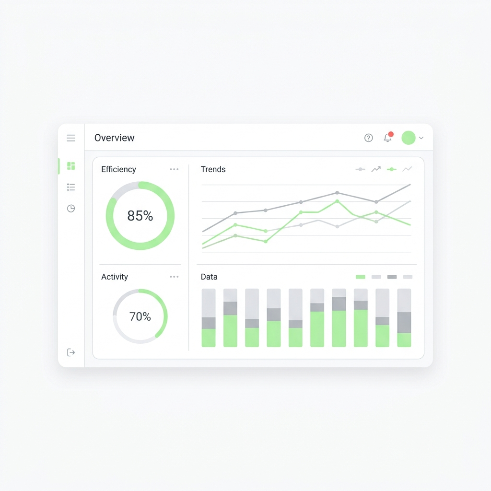

# RateFluencer Nexus (Trend Fatigue Engine AI)

<p align="center">
  
</p>

<h3 align="center">⚡ Sparks Team // Creator Burnout & Trend Telemetry Platform ⚡</h3>

RateFluencer Nexus is a state-of-the-art, high-fidelity creator intelligence and trend fatigue analytics dashboard. By applying mathematical telemetry to the chaos of modern digital culture, RateFluencer Nexus detects the exact moment when interest peaks and audience burnout begins—giving creators, marketers, and brands the data-driven foresight to pivot before a topic is completely saturated.

---

## 👥 Meet Team Sparks
*   **Team Name:** Sparks
*   **Team Members:**
    1.  **Jyotasana**
    2.  **Arpita Matta**
    3.  **Anand Minejes**

---

## 🚨 Problem Statement (PS)
In the hyper-accelerated attention economy of 2026, content creators and brands blindly chase viral trends. However, this herd behavior leads to rapid narrative over-saturation, commonly known as **Trend Fatigue**. 
*   **Blind Replication:** Creators jump on viral waves (e.g., "Faceless AI Channels" or "Performative LinkedIn Posts") without knowing their current lifespan.
*   **Immediate Audience Rejection:** Viewers swipe away instantly upon seeing repetitive formats, severely damaging organic reach and creator engagement metrics.
*   **Inefficient Content Creation:** Hundreds of hours are wasted producing content for niches that have already reached critical burnout.
*   **No Predictive Exits:** Existing analytics tools track *past* popularity but fail to warn creators *when to stop* or *how to pivot* effectively.

---

## 💡 The Solution
**RateFluencer Nexus** introduces a mathematical, NLP-driven layer over cultural trends. Instead of merely reflecting historical volume, the system actively calculates real-time **Audience Fatigue Indices** and crafts high-virality **Counter-Narratives (Reversal Strategies)**.
*   **Telemetry Forecasting:** Tracks attention velocity, keyword frequency, and consumer comment sentiment to forecast the exact "Fatigue Event Horizon."
*   **Actionable Strategic Pivots:** Generates copy-ready, highly engaging script hooks and alternative opportunity angles that run counter to saturated trends.
*   **Data-Backed Proof Workspace:** Equips creators with direct, interactive dashboards comparing falling, oversaturated niches with rising, authentic alternatives.

---

## 🚀 Key Features

### 1. WaveShift Telemetry Dashboard
An interactive preview panel visualizing the convergence of saturated trends against fresh organic opportunities.
*   **Visual Crossover Curves:** Highly responsive SVG charts tracking the intersection where interest declines and opportunity rises.
*   **Real-Time Status Indicators:** Color-coded metrics displaying fatigue percentages and growth rates.

### 2. Fatigue Radar Workspace
The tactical command center of the platform where active burnout trends are isolated and examined.
*   **burnout Telemetry:** Immediate breakdown of active trends, including sentiment keywords (e.g., *robotic*, *cringe*, *spammy*, *forced*).
*   **Interactive Metric Progress Meters:** Visual vertical tracking meters showcasing the current fatigue density of each trend out of 100.

### 3. Tactical Reversal Lab (AI Formulator)
An autonomous terminal that ingests saturated trend parameters and compiles a strategic creative brief.
*   **LLM Simulation Console:** Shows real-time log parsing sequences of NLP-density sweeps.
*   **Provocative Hook Generator:** Generates high-impact, copyable opening hook statements for scripts to hook viewers before they swipe away.
*   **One-Click Clipboard Action:** Seamless utility buttons to instantly copy generated hooks for production use.

### 4. Custom Trend Query Engine
Allows creators to input any custom keyword or trend to run an on-the-fly saturation diagnostic.
*   **Simulated Growth Calibration:** Dynamic telemetry log loading.
*   **Live Metrics Calibration:** Auto-populates specific recommendations, fatigue ratings, and interactive charts.

### 5. Automated PDF & Text Reports (Feature 8)
Generate, format, and download fully parsed Trend Analytics reports.
*   **Comprehensive Brief Export:** Compiles key telemetry numbers, AI predictive recommendations, sentiment diagnostics, and counter-narrative outlines with a single click.

---

## 💎 Uniqueness & Innovation

| Aspect | Traditional Analytics Tools | RateFluencer Nexus |
| :--- | :--- | :--- |
| **Primary Focus** | Track historical popularity & volume | Track **exhaustion, saturation, & fatigue indices** |
| **Actionable Insight** | "Produce more of X because it's popular" | "Pivot away from X to Y because X has crossed the Burnout Horizon" |
| **Strategic Guidance** | Raw data graphs | Direct **creative script hooks & disruptive narrative angles** |
| **Aesthetics & UX** | Generic corporate tables & charts | Premium glassmorphism dark-minimalist UI with smooth flow lines |

### 🛠️ Innovation Core:
*   **The Fatigue Event Horizon Metaphor:** Our engine maps social trend cycles as decaying orbits. The convergence point is mathematically identified as the *Fatigue Event Point*, illustrating exactly when user patience runs out.
*   **Quantitative + Qualitative Alignment:** Seamlessly connects statistical numbers (Growth, Saturation, Attention Velocity) with specific qualitative scripting angles, bridging the gap between data science and creative copy.
*   **Modern Visual Engineering:** Utilizes custom-curated color palettes (`#AEF597` lime neon and rich dark violet `#090716`), smooth glassmorphic containers, and interactive SVG graphing algorithms.

---

## 🛠️ Tech Stack & Architecture
RateFluencer Nexus is built on a modern, ultra-performant framework:
*   **Core Framework:** [Next.js 15](https://nextjs.org/) (App Router) & [React 19](https://react.dev/)
*   **Language:** [TypeScript](https://www.typescriptlang.org/) (fully static, zero-warning compilation)
*   **Styling & Design System:** [Tailwind CSS v3](https://tailwindcss.com/) with a custom dark-minimalism glassmorphism system
*   **State Management:** [Zustand](https://github.com/pmndrs/zustand) for lightweight, high-performance client state synchronization
*   **Icons:** [Lucide React](https://lucide.dev/) for crisp, scalable iconography
*   **Data Visualization:** Custom inline SVGs for responsive, interactive, dependency-free charting

---

## 💻 Installation & Setup Guide

Follow these steps to clone the repository and run RateFluencer Nexus locally:

### 1. Cloning the Repo
First, clone the repository from GitHub:
```bash
git clone https://github.com/Jyotasana17/RateFluencer-Nexus.git
```

Navigate into the project directory:
```bash
cd RateFluencer-Nexus
```

### 2. How to Install the Packages
Ensure you have Node.js (version 18 or 20 recommended) installed. Install all required dependencies using npm:
```bash
npm install
```

### 3. Local Development Run
Start the development server:
```bash
npm run dev
```

Open your browser and navigate to:
```text
http://localhost:3000
```

To access the direct dashboard workspace directly, navigate to:
```text
http://localhost:3000/dashboard/fatigue-radar
```

### 4. Build & Production Export
To create an optimized production build or static export:
```bash
npm run build
```
The static export files will be written to the `out/` directory.

---

## 🌐 Netlify Deployment
This repository contains a pre-configured `netlify.toml` file. To deploy:
1.  Connect your GitHub repository to **Netlify**.
2.  Set the following build configuration:
    *   **Base directory:** `RateFluencer-Nexus` (if deploying from a parent repository)
    *   **Build command:** `npm run build`
    *   **Publish directory:** `out`
3.  Deploy!

---

## 📄 License
Copyright © 2026 RateFluencer Nexus (Sparks Team). All rights reserved. Built with passion by Jyotasana, Arpita Matta, and Anand Minejes.
